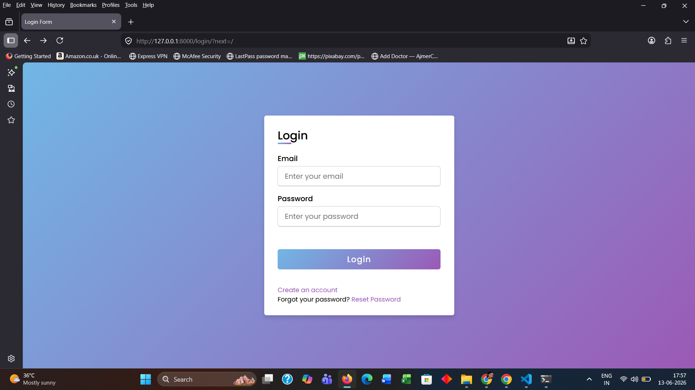
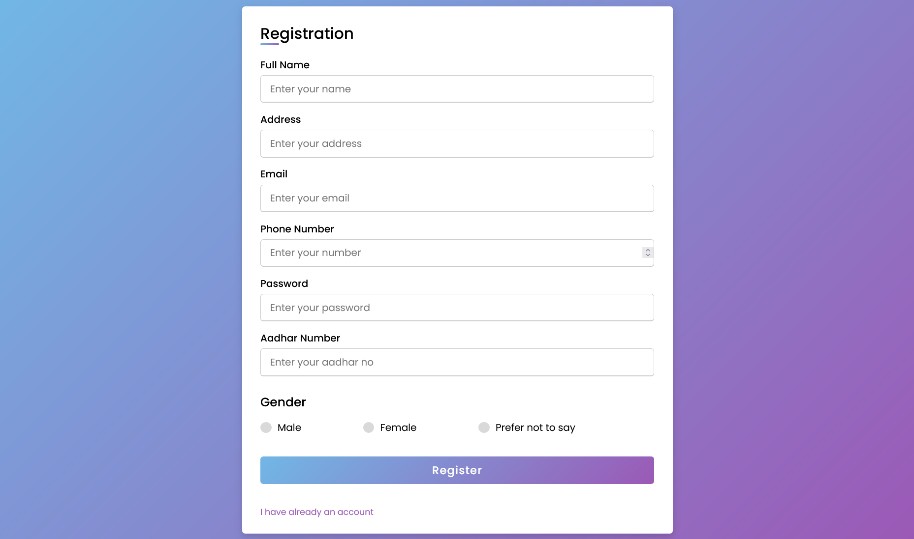
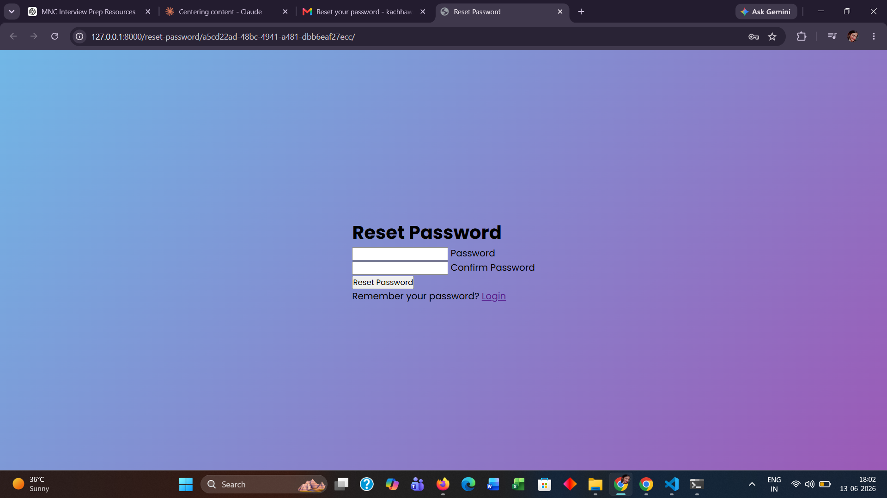
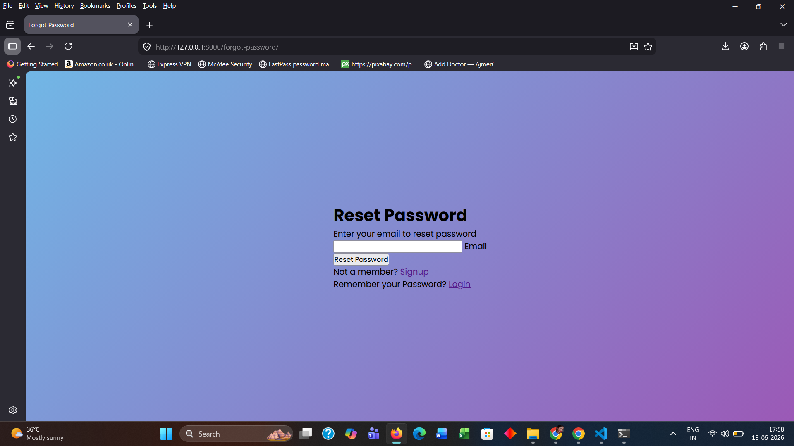

# Django Authentication System

A complete user authentication system built with Django, featuring registration, login, logout, and password reset via email.

---

## Features

- User Registration (Full Name, Email, Password, Address, Phone, Aadhar, Gender)
- User Login with email & password
- Logout
- Forgot Password — sends reset link via email
- Password Reset with 10-minute expiry link
- Django Messages for success/error alerts
- Responsive UI with gradient styling (Poppins font)

---

## Tech Stack

| Layer | Technology |
|---|---|
| Backend | Python 3.12, Django 5.1 |
| Frontend | HTML5, CSS3 |
| Database | MySQL |
| Auth | Django built-in `django.contrib.auth` |
| Email | Django SMTP (Gmail) |

---

## Project Structure

```
Authentication/          ← Django project settings
core/                    ← Main app
  models.py              ← PasswordReset model
  views.py               ← All auth views
  urls.py                ← URL routes
templates/
  login.html
  register.html
  forgot_password.html
  password_reset_sent.html
  reset_password.html
  index.html
static/
  style.css              ← Shared styles for all auth pages
screenshots/
  login.png
  register.png
  create_password.png
  reset_password.png
  reset_sent.png
```

---

## URL Routes

| URL | View | Name |
|---|---|---|
| `/` | Home (login required) | `home` |
| `/register/` | RegisterView | `register` |
| `/login/` | LoginView | `user_login` |
| `/logout/` | LogoutView | `logout` |
| `/forgot-password/` | forgot_passwordView | `forgot_password` |
| `/password-reset-sent/<reset_id>/` | Password_Reset_Sent | `password_reset_sent` |
| `/reset-password/<reset_id>/` | Reset_Password | `reset_password` |

---

## Setup & Installation

### 1. Clone the repository

```bash
git clone https://github.com/meghakachhawa05/Authentication.git
cd Authentication
```

### 2. Create virtual environment

```bash
python -m venv venv
venv\Scripts\activate
```

### 3. Install dependencies

```bash
pip install django python-dotenv
```

### 4. Configure environment variables

Create a `.env` file in the root directory:

```
SECRET_KEY=your_django_secret_key
EMAIL_HOST_USER=your_email@gmail.com
EMAIL_HOST_PASSWORD=your_app_password
DEBUG=True
```

> For Gmail, enable 2-factor authentication and generate an App Password.

### 5. Add email settings in `settings.py`

```python
EMAIL_BACKEND = 'django.core.mail.backends.smtp.EmailBackend'
EMAIL_HOST = 'smtp.gmail.com'
EMAIL_PORT = 587
EMAIL_USE_TLS = True
EMAIL_HOST_USER = os.environ.get('EMAIL_HOST_USER')
EMAIL_HOST_PASSWORD = os.environ.get('EMAIL_HOST_PASSWORD')
```

### 6. Run migrations

```bash
python manage.py migrate
```

### 7. Start the server

```bash
python manage.py runserver
```

Open `http://127.0.0.1:8000/` in your browser.

---

## How It Works

### Registration
- User fills Full Name, Address, Email, Phone, Password, Aadhar, Gender
- Duplicate email check before saving
- Password minimum 5 characters
- On success → redirects to Login

### Login
- Email + Password authentication
- Uses Django's `authenticate()` and `login()`
- On success → redirects to Home (login required)

### Forgot Password
- User enters registered email
- System generates a unique UUID reset link
- Reset link sent via email (valid for 10 minutes)
- On expiry → link is deleted from database

### Password Reset
- User sets new password via the emailed link
- Passwords must match and be at least 5 characters
- On success → redirects to Login

---

## Models

### `PasswordReset`
```python
class PasswordReset(models.Model):
    user         = models.ForeignKey(User, on_delete=models.CASCADE)
    reset_id     = models.UUIDField(default=uuid.uuid4, unique=True, editable=False)
    created_when = models.DateTimeField(auto_now_add=True)
```

---

## Security Notes

- Passwords stored using Django's built-in hashing (PBKDF2)
- Reset links expire after 10 minutes
- `@login_required` decorator protects the home page
- CSRF protection enabled on all forms
- Secret key and email credentials stored in `.env` file

---

## Screenshots

### Login Page


### Registration Page


### Forgot Password


### Reset Password


### Reset Link Sent


---

## Author

**Er. Megha** — [GitHub](https://github.com/meghakachhawa05)